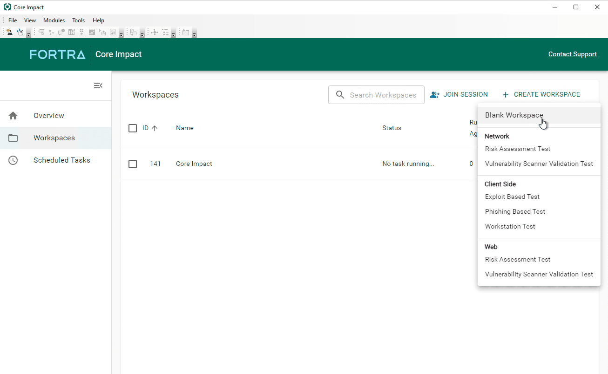
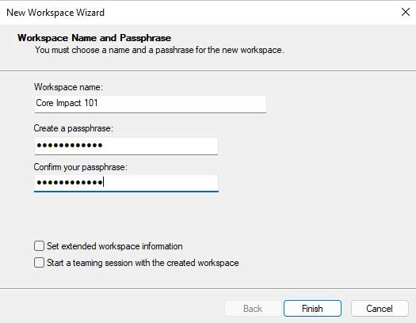

### **First Steps**

### **Installing Core Impact**

Después de instalar la última versión del software (si no lo has hecho, consulta [Installing Core Impact(opens in a new tab)](https://hstechdocs.helpsystems.com/manuals/corects/impact/current/userguide/content/topics/appx_install_topic-start.html) para obtener instrucciones detalladas de instalación), busca la carpeta de **Core Impact** en el menú **START** y selecciona el ícono de **Core Impact**.

### Installing Core Impact License Bundle

El correo enviado por [Fortra(opens in a new tab)](http://www.fortra.com/) contiene el enlace para descargar el **license bundle** y una contraseña que debe aplicarse durante la instalación. Sigue las instrucciones descritas en la guía de instalación, sección [Licensing the Product(opens in a new tab)](https://hstechdocs.helpsystems.com/manuals/corects/impact/current/userguide/content/topics/appx_install_lic-bundle.htm).

### **Activating Core Impact**

La primera vez que ejecutes **Core Impact** en un nuevo equipo, se te presentará el **Activation Wizard**. Debes activar **Core Impact** para que funcione. Consulta [Activating the Product(opens in a new tab)](https://hstechdocs.helpsystems.com/manuals/corects/impact/current/userguide/content/topics/appx_install_activate-wizard.htm) para obtener instrucciones detalladas.

Una vez activado, **Core Impact** se iniciará automáticamente y se lanzará después de [crear las bases de datos necesarias (opens in a new tab)](https://hstechdocs.helpsystems.com/manuals/corects/impact/current/userguide/content/topics/appx_install_db-create-wizard.html) en la primera ejecución.

### **The Dashboard**

Una vez que se inicia **Core Impact**, se te presentará el **Core Impact Dashboard**.

El **Dashboard** está dividido en varios componentes, cada uno presentándote información en tiempo real sobre tu instalación de **Core Impact**, así como resúmenes de la cobertura de exploits comerciales de grado líder en el mercado del producto.

Además de eso, puedes ver una lista de los exploits, utilidades y módulos de mantenimiento actualmente disponibles que están pendientes de instalación. Estos mantienen **Core Impact** actualizado con las últimas tendencias de ataque y amenazas de vulnerabilidades.

### **Workspaces**
### Creating a Workspace

Todas las tareas y resultados de pentesting en **Core Impact** se realizan en **workspaces** que pueden usarse para separar las sesiones de pentesting y revisar los resultados en un momento posterior.

### New Workspace

Desde el **Core Impact Dashboard**, ve a **Workspaces** en el menú de la izquierda, haz clic en **Create Workspace** y luego en **Blank Workspace**.

### Workspace Settings

Ingresa un **Workspace name** y una **Passphrase** (que debe tener al menos 8 caracteres de longitud).

También es posible establecer información extendida del **workspace** como el nombre de la empresa, la información de contacto, fechas, ...

Marcar la opción "Start teaming session with the created workspace" creará automáticamente una sesión colaborativa de [Teaming(opens in a new tab)](https://hstechdocs.helpsystems.com/manuals/corects/impact/current/userguide/content/topics/wrkspc-teaming_teaming.html).

Haz clic en **Finish**.

### Wait for completion ⌛

Una vez finalizado, se abrirá un nuevo **workspace** vacío.