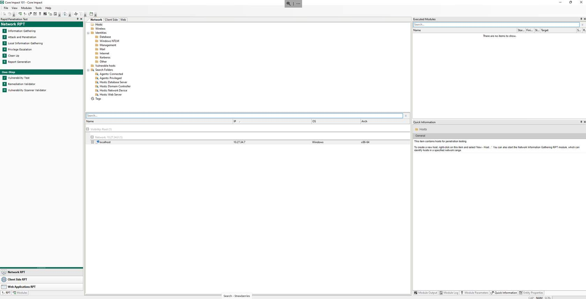
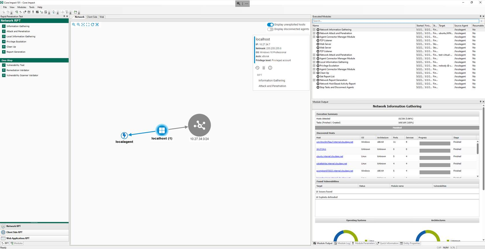
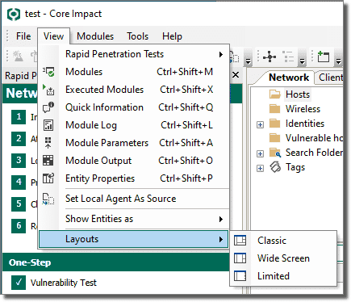

Esta sección proporcionará un breve recorrido por los principales elementos de la UI del *workspace*. Un *workspace* es un lugar donde se almacena la información relacionada con una prueba específica. Consulta [Workspaces and Teaming(opens in a new tab)](https://hstechdocs.helpsystems.com/manuals/corects/impact/current/userguide/content/topics/wrkspc-teaming_chapter-start.htm#chapter_manageworkspaces) para obtener información más detallada sobre *workspaces* y el *New Workspace Wizard* así como sobre cómo crear *Teaming Workspaces*.

Después de crear un nuevo *workspace* o abrir uno existente, aparece la *Core Impact Console*. La *Console* es la ventana principal que usarás para iniciar escaneos, lanzar ataques y gestionar la actividad de los *agents*. Los cinco paneles que componen la *Console* se describen en detalle a continuación.

Si eres una persona visual, el *Attack Map* de *Core Impact* proporciona una visión general en tiempo real de las cadenas de ataque, el pivoting y cualquier otra actividad completada durante las pruebas. El *Attack Map* es completamente interactivo y puede ser utilizado como el espacio de trabajo principal para los testers que prefieren una experiencia totalmente visualizada del *engagement*.

La navegación por la *Core Impact Console* es sencilla: simplemente haz clic entre los paneles y sus pestañas disponibles, o usa el menú desplegable *View* para activar o ocultar un componente o barra de herramientas de la *console*.

Dentro del menú desplegable *View*, también puedes seleccionar entre tres *Layouts* para mostrar/ocultar rápidamente varios paneles de la *Core Impact Console*. Elige entre *Classic*, *Wide Screen* o *Limited*.

Usaremos el *Wide Screen layout* en este curso para demostrar las diferentes características de *Core Impact*.