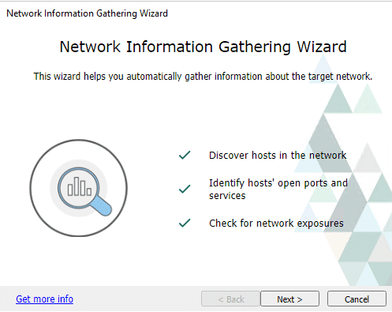
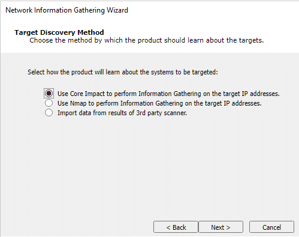
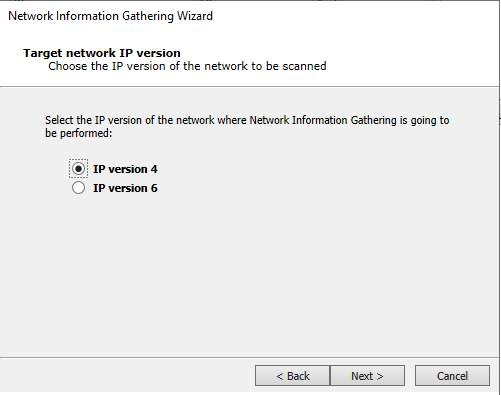
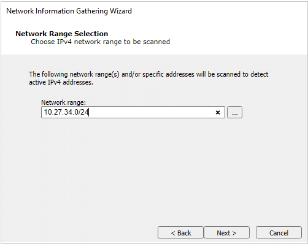
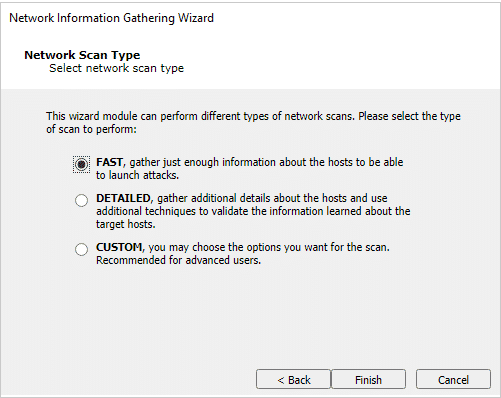
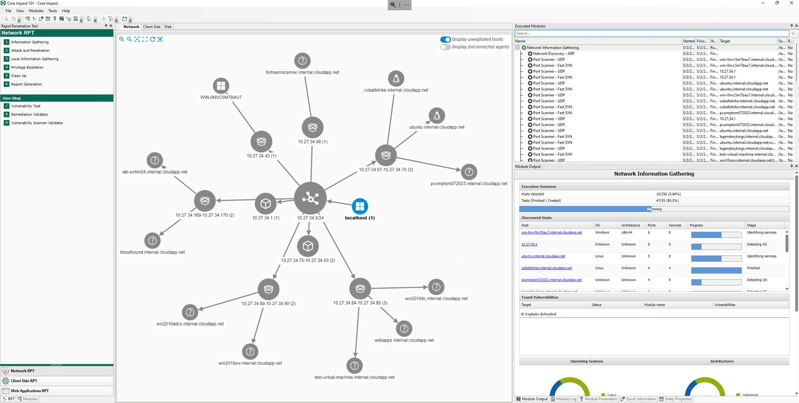

¿Alguna vez has escuchado el dicho "el conocimiento es poder"? Bueno, en el mundo del *penetration testing*, eso no podría ser más cierto. El reconocimiento, o como nos gusta llamarlo, *information gathering*, es como la salsa secreta que hace que todo lo demás sepa mejor.

Claro, puede que no suene tan impresionante como hackear sistemas o romper códigos, pero créeme, es el verdadero MVP de la operación. Aquí es donde arremangamos nuestras camisas y nos ponemos manos a la obra, desenterrando toda la información posible sobre nuestro objetivo.

Así que, en esta sección, vamos a sumergirnos en el mundo del *network reconnaissance* a través de *Core Impact*.

## **Network Information gathering through Core Impact**

### Network Information Gathering RPT

El paso de *Network Information Gathering* te proporciona información sobre una red objetivo o una máquina individual. Este paso generalmente se lleva a cabo ejecutando módulos de la subcategoría *Information Gathering*, como *Network Discovery*, *Port Scanning*, *OS Identification*, y *Service Identification*.

En esta sección, proporcionaremos un ejemplo de cómo realizar el paso de reconocimiento utilizando el asistente de *Rapid Penetration Test* de *Core Impact*. Si deseas aprender más sobre cómo ejecutar este proceso, consulta la sección "[_Network Information Gathering_](https://hstechdocs.helpsystems.com/manuals/corects/impact/current/userguide/content/topics/rpt_network_info-gathering.htm)" en la guía del usuario.

¡Vamos a verlo en acción!

### Launching the wizard

Desde el **RPT Pane**, selecciona y haz clic en **Network Information Gathering** RPT para descubrir hosts en la red. Haz clic en **Next**.

### Target Discovery Method

Selecciona el Target Discovery Method.

- Usar *Core Impact* para realizar *Information Gathering* utilizará sus módulos internos para recopilar información sobre *OS*, *Ports*, *Services*, *Applications*, ...
- Usar la opción *NMAP* realizará un escaneo de puertos con *NMAP* e importará sus resultados en *Core Impact*.
- Import Data from a 3rd party scanner te permitirá usar la salida de un *Vulnerability Scanner* previamente lanzado de los proveedores más comunes, incluyendo [Fortra Vulnerability Management](https://www.digitaldefense.com/platform/fortra-vm/).

Para el ejemplo, seleccionaremos la primera opción. Haz clic en **Next**.

### Target Network IP version

Haz clic en **Next** después de seleccionar IP version 4.

### Network Range Selection

Haz clic en **Next** después de seleccionar el rango de red objetivo.

| Información                                                                                                                                           |
| ------------------------------------------------------------------------------------------------------------------------------------------ |
| **🛈** El rango de red se inicializará en la red local de la interfaz de red actualmente seleccionada del *localagent* de *Core Impact*. |

### Network Scan Type

Selecciona el nivel de detalle del escaneo de red:

- **FAST**: La prueba captura la cantidad mínima de datos necesarios para lanzar ataques. No habrá pasos adicionales en el asistente si seleccionas esta opción.
- **DETAILED**: La prueba ejecuta más módulos para descubrir detalles adicionales, potencialmente útiles, sobre los sistemas objetivo. Habrá [pasos adicionales](https://hstechdocs.helpsystems.com/manuals/corects/impact/current/userguide/content/topics/rpt_network_info-gathering-target-specific-ips.htm#detailed_scan) en el asistente si seleccionas esta opción.
- **CUSTOM**: Configuras cómo *Core Impact* ejecutará el proceso de *Information Gathering*. Habrá [pasos adicionales](https://hstechdocs.helpsystems.com/manuals/corects/impact/current/userguide/content/topics/rpt_network_info-gathering-target-specific-ips.htm#custom_scan) en el asistente si seleccionas esta opción.

Para este ejemplo, selecciona **Fast** y haz clic en **Finish**.

### Wait for Completion ⌛

Espera a que el **Network Information Gathering** RPT termine de recopilar información sobre la red.

---

💡 La topología de la red se puede mostrar como un gráfico cambiando la vista a través del menú **View** > **Show entities as** > **Map option**. 