Ahora que hemos establecido las bases con el reconocimiento y *information gathering*, es hora de cambiar de marcha y profundizar en el corazón del *penetration testing*: la explotación y la post-explotación. Esta fase representa la coyuntura donde la teoría se transforma en acción, donde las vulnerabilidades identificadas durante el escaneo se convierten en vías de infiltración.

En el ámbito de la ciberseguridad, la explotación es similar a manejar una espada de doble filo. Por un lado, sirve como un medio para demostrar la fragilidad de los sistemas, exponiendo debilidades que los adversarios podrían explotar de manera maliciosa. Por otro lado, sirve como un crisol para la fortificación, permitiendo a las organizaciones fortalecer sus defensas al abordar las vulnerabilidades identificadas.

Durante esta sección, navegaremos por el paisaje de la explotación, explorando las técnicas y herramientas proporcionadas por *Core Impact* para aprovechar las vulnerabilidades identificadas.

Consulta la lista completa de [Core Impact Exploits](https://www.coresecurity.com/core-labs/exploits) y los [criterios que usamos para priorizarlas](https://www.coresecurity.com/products/core-impact/exploits-criteria) para más información.

## Remote Exploitation
### Network Attack and Penetration with Remote Exploits

El paso *Network Attack and Penetration RPT* utiliza la información previamente adquirida sobre la red (como la información que recopilaste usando el paso de *Network Information Gathering*) para seleccionar y lanzar automáticamente ataques remotos.

Para cada host objetivo, este paso requiere la información relacionada con la **IP Address**, **OS**, **Architecture** y **Ports** y **Services**.

En esta sección, proporcionaremos un ejemplo de cómo realizar el paso de *Attack and Penetration* utilizando el asistente de *Rapid Penetration Test* de *Core Impact*. Si deseas aprender más sobre cómo ejecutar este proceso, consulta la sección "[Network Attack and Penetration](https://hstechdocs.helpsystems.com/manuals/corects/impact/current/userguide/content/topics/rpt_network_attack-pen.htm)" en la guía del usuario.

¡Vamos a verlo en acción!

#### Launching the wizard

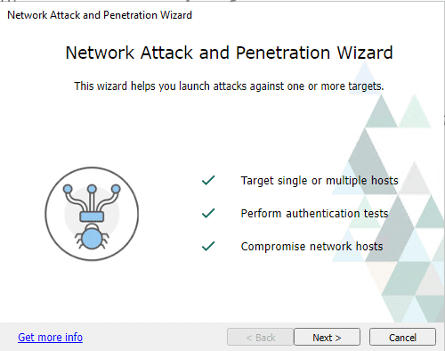

Desde el **RPT Pane**, selecciona y haz clic en **Network Attack and Penetration** RPT para atacar hosts en la red. Haz clic en **Next**.

#### Target Selection

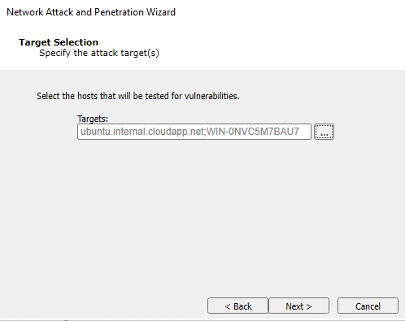

Selecciona los hosts que serán probados en busca de vulnerabilidades. Haz clic en **Next**.

#### Attack Method

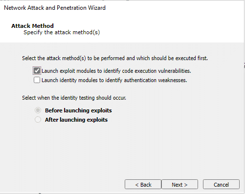

Selecciona *Launch Exploit Modules* para identificar vulnerabilidades de ejecución de código si deseas que el *Attack and Penetration* intente encontrar vulnerabilidades en el *OS* de los hosts objetivo o en cualquier programa instalado. Consulta [Launch Exploit Modules](https://hstechdocs.helpsystems.com/manuals/corects/impact/current/userguide/content/topics/rpt_network_attack-pen.htm#exploit_modules). Haz clic en **Next**.

#### Attack Configuration

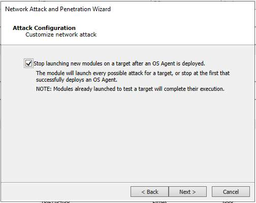

La pantalla de *Attack Configuration* te permite elegir si deseas o no detener el lanzamiento de nuevos módulos en un objetivo después de que se despliegue un *OS Agent*. La opción *Stop launching new modules on a target after an OS Agent is deployed* está destinada a reducir el tiempo de ejecución si el objetivo es simplemente comprometer un host. Si el objetivo es detectar todas las vulnerabilidades explotables en un host, esta opción debe desmarcarse. Haz clic en **Next**.

### Network Attack Setup

En este paso, puedes configurar algunas de las configuraciones de ataque, como los criterios de selección de *exploits* o el orden de ejecución, configuración del *agent*, ...

Haz clic en **Next**.

###  Wait for Completion ⌛

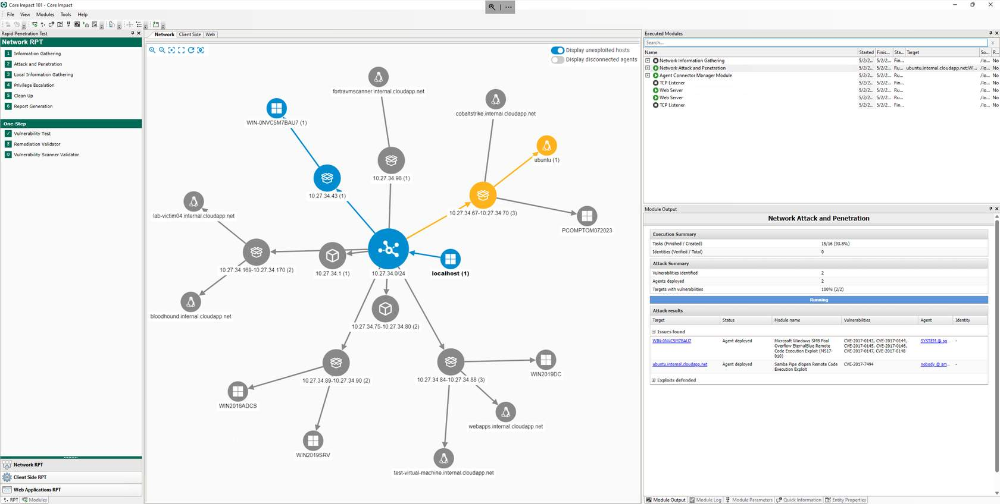

El módulo **Network Attack and Penetration** ejecutará múltiples ataques en paralelo contra cada host objetivo. Cada *exploit* lanzado automáticamente por este paso se mostrará como un hijo del módulo *Attack and Penetration* en el panel *Execute Modules*.

Espera a que el **Network Attack and Penetration** RPT complete la validación de identidades en los objetivos remotos.

Después de un tiempo, si el módulo encuentra una vulnerabilidad explotable, la usará para desplegar un **OS Agent** en el host.

### Network Attack and Penetration with Identity Verifiers

En esta sección, lanzaremos *Network Attack and Penetration* nuevamente, pero en lugar de usarlo para lanzar *exploits* en los sistemas objetivo, se utilizará la funcionalidad de *identity verifiers* para intentar detectar credenciales débiles realizando ataques de diccionario en los sistemas objetivo.

En esta sección proporcionaremos un ejemplo de cómo realizar el paso de *Attack and Penetration* utilizando el asistente de *Rapid Penetration Test* de *Core Impact*. Si deseas aprender más sobre cómo ejecutar este proceso, consulta la sección "[Network Attack and Penetration](https://hstechdocs.helpsystems.com/manuals/corects/impact/current/userguide/content/topics/rpt_network_attack-pen.htm?#:~:text=launched%20an%20attack.-,Launch%20Identity%20Modules,-If%20the%20Identity)" en la guía del usuario.

¡Vamos a verlo en acción!

#### Launching the wizard

Desde el **RPT Pane**, selecciona y haz clic en **Network Attack and Penetration** RPT para atacar hosts en la red. Haz clic en **Next**.

#### Target Selection

Selecciona los hosts que serán probados en busca de vulnerabilidades. Haz clic en **Next**.

#### Attack Method

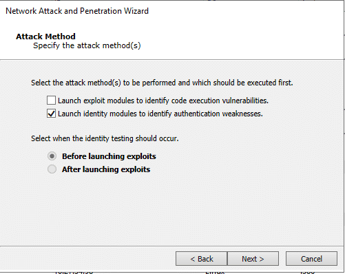

Selecciona "Launch Identity modules to identify authentication weaknesses". Haz clic en **Next**.

#### Attack Configuration

Es posible personalizar el ataque seleccionando si te gustaría detener el lanzamiento de nuevos módulos en un objetivo después de que se despliegue un *OS Agent* (destinado a reducir el tiempo de ejecución si el objetivo es simplemente comprometer un host) o detectar y tratar de explotar todas las vulnerabilidades en un host si el objetivo es ser más exhaustivo.

#### Network Attack Setup

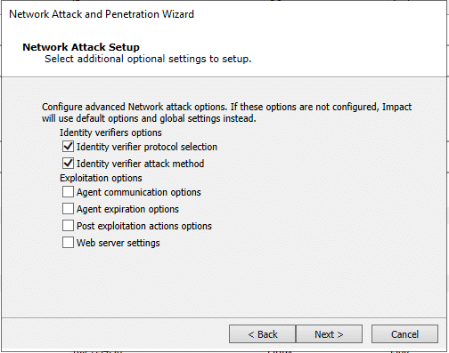

En este paso, puedes configurar algunas de las configuraciones de ataque, como el protocolo de identidad y el método de ataque, configuración del *agent*, ...

Para simplificar, seleccionaremos un protocolo específico y un tipo de ataque específico.

Haz clic en **Next**.

#### Identity Attack Selection

Selecciona el servicio para el cual deseas que *Core Impact* pruebe las identidades, en este ejemplo **SSH**. Haz clic en **Next**.

#### Identity Verifier Attack

Selecciona uno de los *Identity Verifier Attack Types*, en este caso, utilizaremos *Default Identities*. Haz clic en **Next**.

#### Identity Attack Configuration

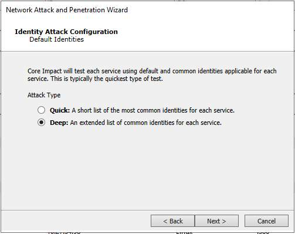

Selecciona *Deep* para utilizar una lista extendida de nombres de usuario y contraseñas comunes para el ataque de diccionario. Haz clic en **Next**.

#### Common Identity Attack Configuration

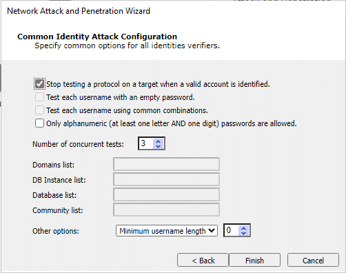

La pantalla de *Common Identity Attack Configuration* es el panel final que se muestra. Con este paso en el asistente, puedes:

- Intentar desplegar un *agent* con identidades descubiertas.
- Dejar de probar ese protocolo en esa máquina cuando se identifique una cuenta válida.
- Probar cada nombre de usuario con una contraseña vacía y combinaciones comunes.

Haz clic en **Finish**.

#### Wait for Completion ⌛

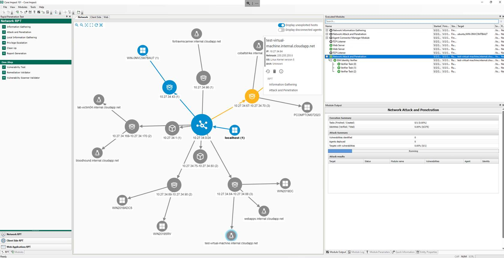

El módulo **Network Attack and Penetration** lanzará y ejecutará el **SSH Identity Verifier**. Este módulo genera varias tareas secundarias para realizar pruebas en paralelo según la configuración, y rota los nombres de usuario probados para tratar de evitar bloqueos.

Espera a que el **Network Attack and Penetration** RPT complete la validación de identidades en los objetivos remotos.

Después de un tiempo, si el módulo encuentra un conjunto válido de credenciales en el sistema objetivo, las usará para desplegar un **OS Agent** en el host.

### Interacting with the deployed agent

Una vez finalizado el ataque, si algún host fue explotable, se deberían haber desplegado uno o más *agents*, y controlar un host comprometido ahora es posible a través del *OS Agent* desplegado.

Este *agent* tiene capacidades para explorar el sistema de archivos local, lanzar programas y crear nuevas conexiones de red desde el host. Consulta la sección [Interacting with Agents](https://hstechdocs.helpsystems.com/manuals/corects/impact/current/userguide/content/topics/appx_controlagents_interacting-w-agents.html) en la guía del usuario para una descripción detallada de las acciones que puedes lanzar desde el *agent* desplegado.

Para explorar

 el host comprometido, **Core Impact** proporciona shells y capacidades de navegación de archivos:

**Launching a Shell**

1. Haz clic derecho sobre el *OS Agent* desplegado en un host y selecciona *Shell*.
2. Puedes ejecutar comandos para explorar el sistema de archivos y lanzar programas en el host.

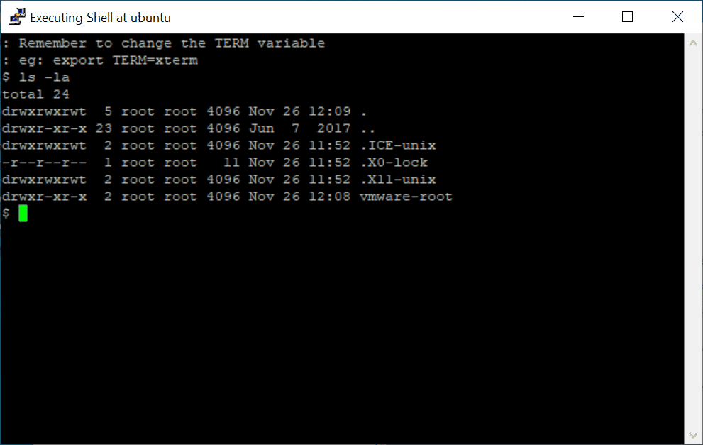

1. Cierra la ventana *Shell* (o ejecuta el comando exit para cerrarla).

#### Launching the File Browser

1. Haz clic derecho sobre el **OS Agent** y selecciona **Browse Files**.
2. Explora los archivos en el host remoto. Es posible explorar interactivamente el sistema de archivos del host, con capacidades para descargar/cargar archivos desde el host.

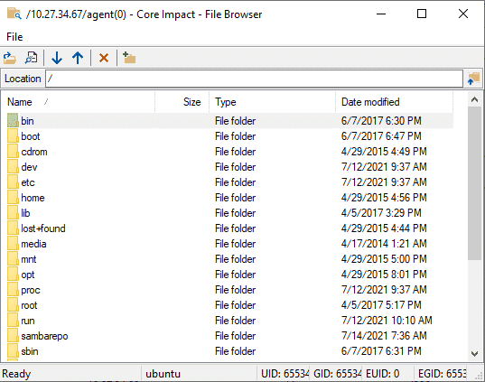

Además de estos módulos, **Core Impact** tiene módulos para recuperar información local de un host donde se ha desplegado un **OS Agent**, que puedes encontrar en la categoría: **01-Information Gathering**/**Local** del panel *Modules*.

### Local Information Gathering

Para mayor comodidad, varios módulos locales que realizan *information gathering* en un host pueden ser lanzados a través del módulo *Network Local Information Gathering* RPT.

#### Network Local Information Gathering

El paso *Local Information Gathering RPT* recopila información sobre hosts que tienen un *agent* desplegado en ellos. Este asistente utiliza el *agent* desplegado para interactuar con el host comprometido y recopilar información como la información precisa del *OS*, privilegios del *agent*, usuarios y aplicaciones instaladas.

En esta sección proporcionaremos un ejemplo de cómo realizar el paso *Local Information Gathering* utilizando el asistente de *Rapid Penetration Test* de *Core Impact*. Si deseas aprender más sobre cómo ejecutar este proceso, consulta la sección "[Local Information Gathering](https://hstechdocs.helpsystems.com/manuals/corects/impact/current/userguide/content/topics/rpt_network_info-gathering-local.htm)" en la guía del usuario.

¡Vamos a verlo en acción!

##### Launching the wizard

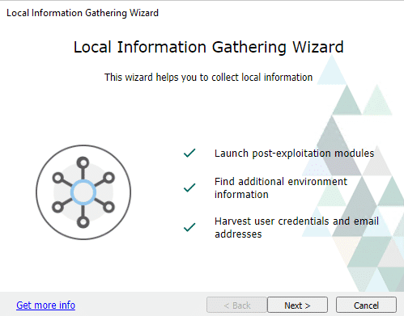

Desde el **RPT Pane**, selecciona y haz clic en **Local Information Gathering** RPT para descubrir información local del host. Haz clic en **Next**.

##### Agent Selection

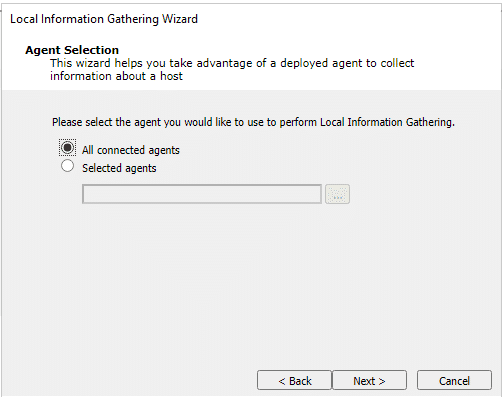

Selecciona los *agents* donde se recopilará la información. Por defecto, se recopilará información en todos los *agents* conectados. Para seleccionar uno o más *agents* específicos, marca la opción *Selected agents* y luego haz clic en el botón de puntos suspensivos (...) y sigue las indicaciones para seleccionar los *agents* deseados.

Haz clic en **Next**.

##### Modules to Run

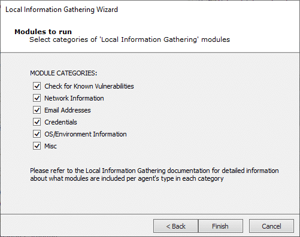

Selecciona las categorías de módulos que deseas ejecutar contra los *agents* previamente seleccionados. Haz clic en **Finish**.

##### Wait for Completion ⌛

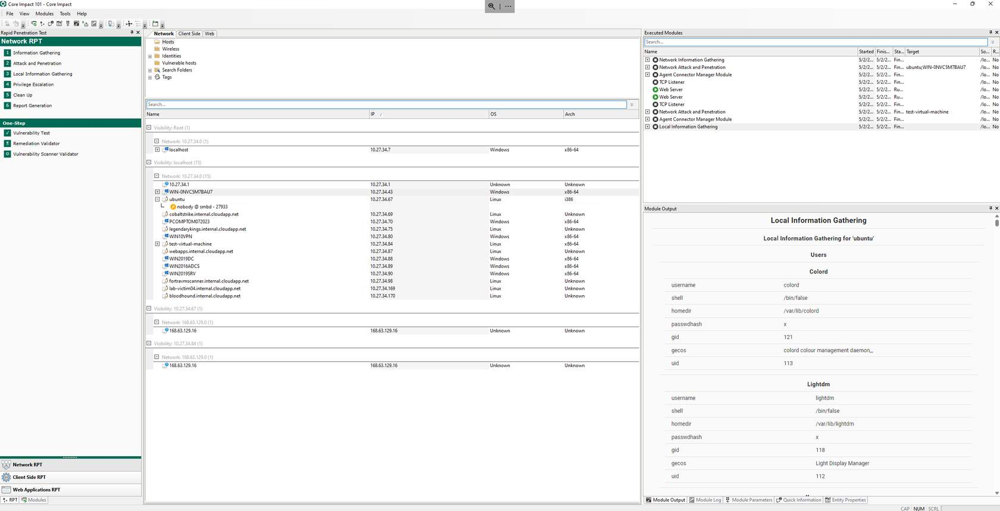

El módulo **Local Information Gathering** se ejecutará y la información se mostrará en los paneles *Module Output* y *Module Log* de la Consola.

Espera a que el **Network Attack and Penetration** RPT complete la validación de identidades en los objetivos remotos.

Después de un tiempo, si el módulo encuentra un conjunto válido de credenciales en el sistema objetivo, las usará para desplegar un **OS Agent** en el host.