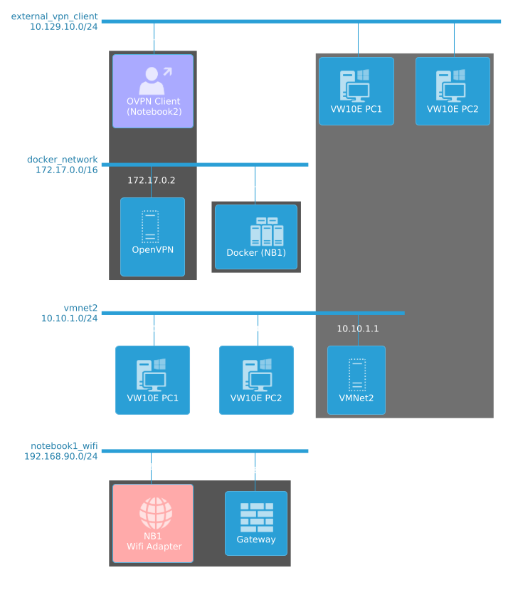
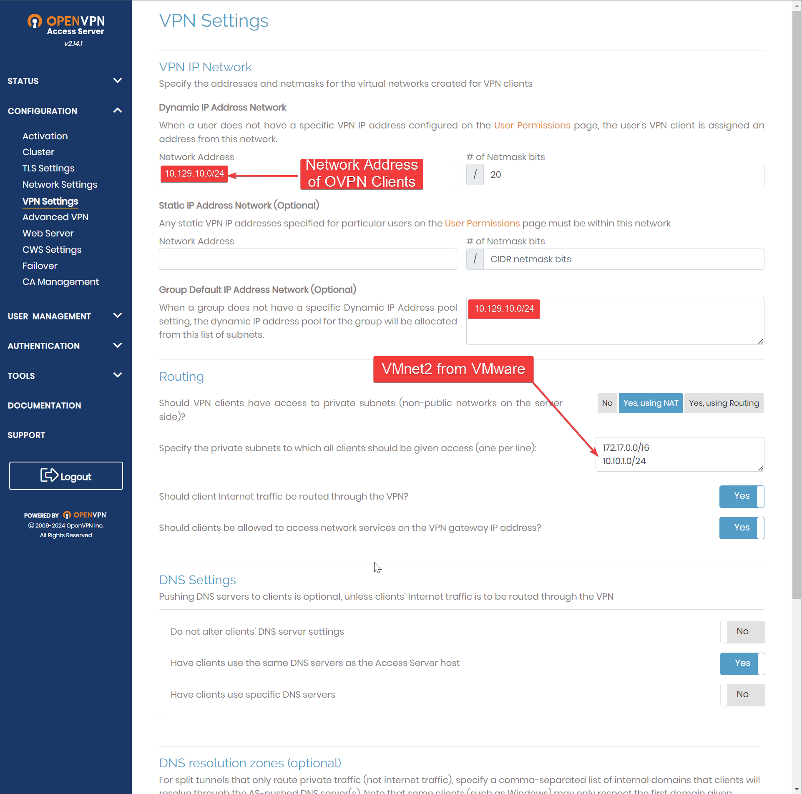
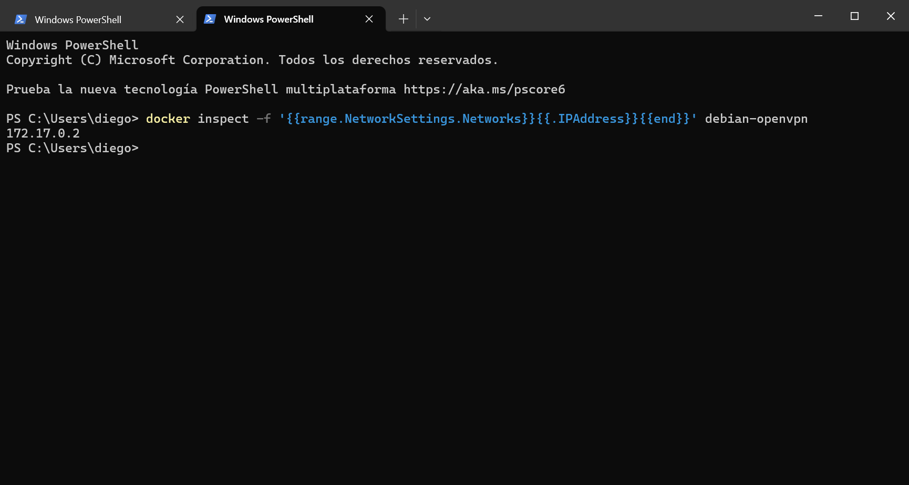
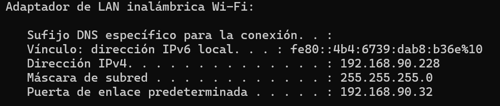
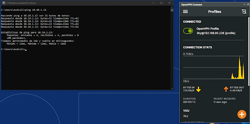

# Project: LAB_3KY - OpenVPN in Docker

## Description

This project was born as part of my cybersecurity practice, inspired by the experience of working on HTB machines with my team **Pwnnet**. From here, I decided to build a lab from scratch, avoiding sticking only to virtual machines (VMs) in **VMware** or **VirtualBox**. In this project, I wanted to take a leap and scale the environment to a new level. This lab is the first result of that effort.

## Lab Features

### UML Diagram


### Hardware

- **Processor:** Intel Core i7 10700KF
- **Motherboard:** Asus Prime z590-p
- **RAM:** 32GB DDR4
- **GPU:** RTX 3050
- **Storage:** 512GB SSD NVMe

### Software

- **OS:** Windows 10 x64 PRO 22H2
- **WSL2** (Required by Docker Desktop) 
- **VMware Workstation Pro 17** (Personal License)
- **Docker Desktop**

## Setup

### OS Installation and Updates

1. **Install** Windows 10 x64 PRO 22H2.
2. Run **Windows Update** to ensure the system is up to date.
3. Install **VMware Workstation PRO 17**.
4. Enable additional features in Windows:
    - Containers
    - Hyper-V
    - Virtual Machine Platform
    - Windows Hypervisor Platform
    - Windows Subsystem for Linux (WSL2)
5. Install the **WSL Package** from [GitHub](https://github.com/microsoft/WSL/releases/tag/2.3.17).
6. Manually install the **Cumulative Update** for Windows:
    - Download the correct update from the [Microsoft Catalog](https://www.catalog.update.microsoft.com/Search.aspx).
    - Follow these instructions:
      ```bash
      Open cmd
      mkdir C:\Temp\kb5041582
      Expand –F:* Downloads\windows10.0-kb5041582-x64_ffdee74386dcaeae70e92fe841aa3d37f58c68a6.msu C:\Temp\kb5041582
      DISM.exe /Online /Add-Package /PackagePath:C:\Temp\kb5041582\Windows10.0-KB5041582-x64.cab
      ```

### Installing Debian in WSL2

1. Run:
   ```bash
   wsl --install debian
   ```
2. Set up a user and password (in this example: debian/debian).
3. Update the system:
   ```bash
   sudo apt update && sudo apt upgrade -y
   ```

### Installing Docker Desktop

1. Download and install **Docker Desktop**.
2. Verify that Docker works correctly within the environment.

## Environment Configuration

1. Disable the **firewall** or configure the appropriate rules for the test environment.
2. Set up the network in **VMware Workstation Pro 17**:
    - Add a **VMNET2 (host-only)** network with the **10.10.1.0/24** subnet, assigning IPs from **10.10.1.10** to **10.10.1.254**.
3. Install Windows 10 Enterprise and add a **vmnet2** network interface.

## OpenVPN Configuration

1. **Start the Debian container for OpenVPN Access Server** in Docker:
   ```bash
   docker run -d --name debian-openvpn --privileged -p 943:943 -p 443:443 -p 1194:1194/udp -p 2222:22 -it debian bash
   docker exec -it debian-openvpn bash
   ```
2. **Install OpenVPN** inside the container:
   ```bash
   apt update && apt -y install ca-certificates wget net-tools gnupg openssh-server
   service ssh start
   passwd root  # (Password: 0p3nVPNIsC00l!)
   mkdir -p /etc/apt/keyrings
   wget https://as-repository.openvpn.net/as-repo-public.asc -qO /etc/apt/keyrings/as-repository.asc
   echo "deb [arch=amd64 signed-by=/etc/apt/keyrings/as-repository.asc] http://as-repository.openvpn.net/as/debian bookworm main" > /etc/apt/sources.list.d/openvpn-as-repo.list
   apt update && apt -y install openvpn-as
   /usr/local/openvpn_as/scripts/openvpnas
   /usr/local/openvpn_as/scripts/sacli status
   ```

3. **Enable IP Forwarding and set iptables rules**:
   ```bash
   echo 1 > /proc/sys/net/ipv4/ip_forward
   echo "net.ipv4.ip_forward=1" >> /etc/sysctl.conf
   sysctl -p
   iptables -A FORWARD -s 10.129.10.0/24 -d 10.10.1.0/24 -j ACCEPT
   iptables -A FORWARD -d 10.129.10.0/24 -s 10.10.1.0/24 -j ACCEPT
   iptables -A FORWARD -m conntrack --ctstate RELATED,ESTABLISHED -j ACCEPT
   ```

4. Access the OpenVPN panel at: `https://localhost:943/admin` using the generated credentials.

5. Activate OpenVPN with the activation code:


6. Configure VPN. Specify which private subnets the client will access, assign the client's IP address, and adjust other settings as desired.


7. Add a new user, 3ky. Pay attention to the options and input a password for the .ovpn profile.


8. In **User Profiles**, generate the *.ovpn file.


9. Modify the generated file.
Review the generated file and change the IP address to a public one. In this case, since you're on the same network as the target machine, use the IP of the **eth0** interface. Replace the IP with the new public IP.

In this case, I replaced `172.17.0.2` (Debian container's IP), which you can verify by running:
```bash
docker inspect -f '{{range.NetworkSettings.Networks}}{{.IPAddress}}{{end}}' debian-openvpn
```



I changed that IP to `192.168.90.228` in the downloaded `generated-file.ovpn` from the OpenVPN Access Server.



Save the file and use it on your external client.

10. With the generated profile, import it and access the **VMware VMNet2 (10.10.1.0/24)** network.


11. Verify connection with the Windows 10 machine on the internal **10.10.1.13** network.


   - Without OpenVPN: The connection fails.
   
   - With OpenVPN: Access to the internal network is obtained.
   

   Check the connection with:
   ```bash
   ipconfig /all
   ```
   Look for the **TAP-Windows Adapter V9 for OpenVPN Connect** adapter.
   

12. UML Diagram created with PlantUML:
```r
@startuml
!include <office/Users/user_external>
!include <office/Servers/virtual_server>
!include <office/Servers/server_farm>
!include <office/Devices/workstation_pc>
!include <office/Concepts/firewall>
!include <office/Concepts/globe_internet>

nwdiag {
    // External network where the OpenVPN client is located
    network external_vpn_client {
        address = "10.129.10.0/24"
        Notebook2 [address = "10.129.10.195", description = "     <$user_external>\n OVPN Client\n (Notebook2)", color = "#AAAAFF"];
    }

    // Internal Docker network in Notebook1
    network docker_network {
        address = "172.17.0.0/16"
        OpenVPN_Server [address = "172.17.0.2", description = "   <$virtual_server>\nOpenVPN\n"];
        Docker_Host [address = "172.17.0.1", description = "        <$server_farm>\nDocker (NB1)"];
    }

    // VMNet2 network in Notebook1 (VMware)
    network vmnet2 {
        address = "10.10.1.0/24"
        VMHost [address = "10.10.1.1", description = "   <$virtual_server>\nVMNet2"];
        Windows10 [address = "10.10.1.13", description = "   <$workstation_pc>\nVW10E PC1"];
        Windows10_2 [address = "10.10.1.14", description =

 "    <$workstation_pc>\nVW10E PC2"];
    }

    // Wi-Fi network of Notebook1
    network notebook1_wifi {
        address = "192.168.90.0/24"
        Notebook1 [address = "192.168.90.228", description =  "     <$globe_internet>\n       NB1\n Wifi Adapter", color = "#FFAAAA"];
        Gateway [address = "192.168.90.32", description = " <$firewall>\nGateway"];
    }

    // OpenVPN group (connection between Debian OpenVPN and Notebook2)
    group OpenVPN {
    //  color = "#FFAAAA"
        Notebook2;
        OpenVPN_Server;
    }

    // VMNet2 group (elements inside the VMware network)
    group VMNet2 {
        color = "707070"
        VMHost;
        Windows10_PC1 [description = "   <$workstation_pc>\nVW10E PC1"];
        Windows10_PC2 [description = "   <$workstation_pc>\nVW10E PC2"];
    }

    // Docker group (internal Docker elements)
    group Docker {
        Docker_Host;
       //OpenVPN_Server;
    }

   // External access group (Wi-Fi and Gateway)
    group ExternalAccess {
        Notebook1;
        Gateway;
    }

}
@enduml
```

## Conclusion

This lab is a first step in creating scalable and controlled environments for pentesting practice. Using Docker to deploy OpenVPN in a Debian container provides great flexibility and control over the network and access, facilitating the simulation of attack and defense scenarios.

## References

- [WSL2 Documentation](https://docs.microsoft.com/en-us/windows/wsl/)
- [OpenVPN Access Server](https://openvpn.net/access-server/)
- [Github Discuss for fixing Docker-Desktop](https://github.com/docker/for-win/issues/14022)