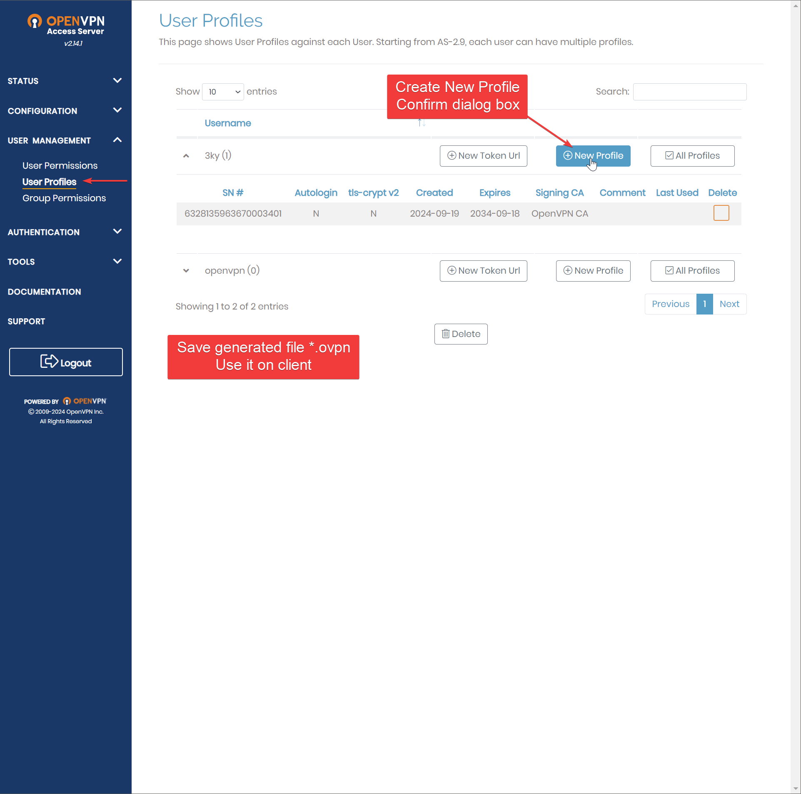

## Que construiremos


### **Container Setup**
```bash
docker run -d --name debian-openvpn --privileged -p 943:943 -p 443:443 -p 1194:1194/udp -p 2222:22 -it debian bash
docker exec -it debian-openvpn bash
apt update && apt -y install ca-certificates wget net-tools gnupg openssh-server
service ssh start
passwd root 
# Set a password like 0p3nVPNIsC00l!
mkdir -p /etc/apt/keyrings
wget https://as-repository.openvpn.net/as-repo-public.asc -qO /etc/apt/keyrings/as-repository.asc
echo "deb [arch=amd64 signed-by=/etc/apt/keyrings/as-repository.asc] http://as-repository.openvpn.net/as/debian bookworm main" > /etc/apt/sources.list.d/openvpn-as-repo.list
apt update && apt -y install openvpn-as
/usr/local/openvpn_as/scripts/openvpnas 
/usr/local/openvpn_as/scripts/sacli status

echo 1 > /proc/sys/net/ipv4/ip_forward
echo "net.ipv4.ip_forward=1" >> /etc/sysctl.conf
sysctl -p

iptables -A FORWARD -s 10.129.10.0/24 -d 10.10.1.0/24 -j ACCEPT 
iptables -A FORWARD -d 10.129.10.0/24 -s 10.10.1.0/24 -j ACCEPT 
iptables -A FORWARD -m conntrack --ctstate RELATED,ESTABLISHED -j ACCEPT

https://localhost:943/admin

cat /usr/local/openvpn_as/init.log | grep "Auto-generated pass"
```

Accede al panel de administración en https://localhost:943/admin utilizando las credenciales generadas.

### **Access Server Activation**


### **OpenVPN Configuration** (VPN Settings)


### **OpenVPN Configuration** (Add Clients)


### **OpenVPN Configuration** (Generate User Profile)


### **OpenVPN Configuration** (Modify OVPN)
Revisa el archivo generado y modifica la dirección IP por una pública. En este caso, como estás en la misma red que la máquina objetivo, usarás la IP de la interfaz **eth0**. Reemplaza la IP por la nueva IP pública.

En este caso, reemplacé `172.17.0.2` (Dirección IP del contenedor Debian), que puedes verificar ejecutando:
```bash
docker inspect -f '{{range.NetworkSettings.Networks}}{{.IPAddress}}{{end}}' debian-openvpn
```


Así que cambié esa IP por `192.168.90.228` en el archivo `generated-file.ovpn` descargado desde el servidor OpenVPN Access.


Guarda el archivo.

---

### **Disable Firewall on Host Machine (Optional)**
Te sugiero deshabilitar el firewall primero, o pensar bien en las reglas.


### **Testing the configuration**
Con el perfil de cliente OVPN generado, "3ky" debería poder acceder a la red VMware VMNet2 (10.10.1.0/24), como la máquina Windows 10 (10.10.1.13).

Aquí puedes ver el `W10Ex64` corriendo en mi **VMware**. La **IP Address** es 10.10.1.13.


Sin OVPN, primero probamos si Notebook-2 puede alcanzar VMNet2:

Por supuesto la respuesta es `no`. 

Ahora, conectando con el perfil generado:


Podemos verificar la IP asignada al cliente y cambiarla si es necesario:


Ahora podemos verificar que tenemos acceso a la red interna de VMware que está corriendo en Notebook-1.


Podemos verificar ejecutando `ipconfig /all` y buscando **TAP-Windows Adapter V9 for OpenVPN Connect**


---

### **Diagrama con PlantUML:**


```r
@startuml
!include <office/Users/user_external>
!include <office/Servers/virtual_server>
!include <office/Servers/server_farm>
!include <office/Devices/workstation_pc>
!include <office/Concepts/firewall>
!include <office/Concepts/globe_internet>

nwdiag {
    // Red externa donde está el cliente de OpenVPN
    network external_vpn_client {
        address = "10.129.10.0/24"
        Notebook2 [address = "10.129.10.195", description = "     <$user_external>\n OVPN Client\n (Notebook2)", color = "#AAAAFF"];
    }

    // Red Docker interna en Notebook1
    network docker_network {
        address = "172.17.0.0/16"
        OpenVPN_Server [address = "172.17.0.2", description = "   <$virtual_server>\nOpenVPN\n"];
        Docker_Host [address = "172.17.0.1", description = "        <$server_farm>\nDocker (NB1)"];
    }

    // Red VMNet2 en Notebook1 (VMware)
    network vmnet2 {
        address = "10.10.1.0/24"
        VMHost [address = "10.10.1.1", description = "   <$virtual_server>\nVMNet2"];
        Windows10 [address = "10.10.1.13", description = "   <$workstation_pc>\nVW10E PC1"];
        Windows10_2 [address = "10.10.1.14", description = "    <$workstation_pc>\nVW10E PC2"];
    }
    

    // Red Wi-Fi de Notebook1
    network notebook1_wifi {
        address = "192.168.90.0/24"
        Notebook1 [address = "192.168.90.228", description =  "     <$globe_internet>\n       NB1\n Wifi Adapter", color = "#FFAAAA"];
        Gateway [address = "192.168.90.32", description = " <$firewall>\nGateway"];
    }


    // Grupo OpenVPN (conexión entre Debian OpenVPN y Notebook2)
    group OpenVPN {
    //  color = "#FFAAAA"
        Notebook2;
        OpenVPN_Server
    }

    // Grupo VMNet2 (elementos dentro de la red VMware)
    group VMNet2 {
        color = "707070"
        VMHost;
        Windows10_PC1 [description = "   <$workstation_pc>\nVW10E PC1"];
        Windows10_PC2 [description = "   <$workstation_pc>\nVW10E PC2"];
    }

    // Grupo Docker (elementos internos en Docker)
    group Docker {
        Docker_Host;
       //OpenVPN_Server;
    }

   // Grupo de acceso externo (Wi-Fi y Gateway)
    group ExternalAccess {
        Notebook1;
        Gateway;
    }

}
@enduml
```

